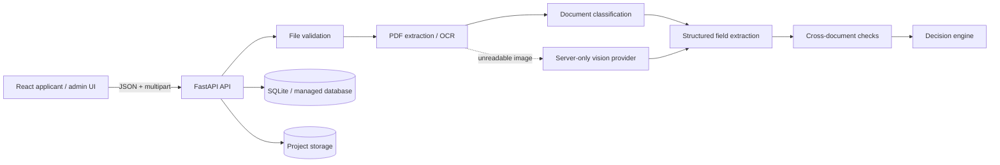

# SmartApply

**Evidence-led application document processing and review workspace.**

SmartApply is a full-stack application that helps process scholarship, admission, and loan applications by validating uploaded documents, identifying their expected document type, extracting key fields with confidence, cross-checking those fields against the application form and other documents, and routing uncertain cases to manual review.

The project is designed around a simple principle: **do not guess when document evidence is unclear**. Readable documents can be verified automatically; mismatches, missing information, low-confidence extraction, or unreadable scans are surfaced as actionable issues for correction or human review.

> **Hackathon project:** This repository contains the Manas-built SmartApply application, including its frontend, FastAPI backend, Docker deployment configuration, tests, and local development setup.

---

## ✨ What SmartApply Does

SmartApply provides an applicant-facing workflow and a review-desk workflow.

### Applicant workflow

1. Create an application with:
   - Name
   - Email
   - Date of birth
   - Application type
   - Marks percentage
   - Family income
2. Upload the required evidence:
   - **ID proof**
   - **Marksheet**
   - **Income certificate**
3. Analyze each document on the server.
4. View:
   - Detected document type
   - Extracted fields
   - Extraction confidence
   - Verification status
   - Cross-document checks
   - Specific correction/review guidance
5. Resubmit corrected application information when required.

### Review workflow

The `/admin` review desk provides an application queue with status and document-health information, allowing a reviewer to identify applications that are approved, need correction, are rejected, or require manual review.

---

## 🧠 Core Processing Pipeline

```text
Applicant UI
    │
    ▼
FastAPI API
    │
    ├── File validation
    │      ├── PDF / JPG / JPEG / PNG checks
    │      ├── File signature validation
    │      ├── Empty-file detection
    │      └── Upload-size limit
    │
    ▼
Text extraction
    │
    ├── PDF text extraction with pypdf
    ├── Tesseract OCR for image files
    └── Optional server-side vision provider for difficult image scans
    │
    ▼
Document classification
    │
    ▼
Structured field extraction
    │
    ▼
Cross-document + form checks
    │
    ├── Name
    ├── Date of birth
    ├── Marks percentage
    ├── Family income
    ├── Document type
    ├── Required-document presence
    ├── Cross-document consistency
    └── Signature/seal signal
    │
    ▼
Decision engine
    │
    ├── Approved
    ├── Needs Correction
    ├── Manual Review
    └── Rejected
```

The browser does **not** decide document type or application outcome. The backend performs validation, extraction, persistence, and deterministic cross-checking before returning the result.

---

## 🏗️ Architecture



### Main components

| Component | Technology | Purpose |
|---|---|---|
| Frontend | React + TypeScript + Vite | Applicant and review-desk UI |
| Backend | FastAPI + Python | API, processing pipeline, decision logic |
| Database | SQLAlchemy + SQLite fallback | Application/document/check persistence |
| PDF extraction | `pypdf` | Extract text from text-based PDFs |
| Image OCR | Tesseract, when installed | Extract text from image documents |
| Optional vision | Server-side OpenAI-compatible endpoint | Vision extraction for difficult image scans |
| Styling/icons | CSS + Lucide React | Application interface |
| Container | Docker | Reproducible deployment |
| Package manager | pnpm | Frontend dependency/build workflow |
| Testing | pytest + TypeScript typecheck | Backend and frontend verification |

---

## 📁 Project Structure

```text
.
├── backend/
│   ├── app/
│   │   ├── db.py
│   │   ├── main.py
│   │   ├── models.py
│   │   ├── schemas.py
│   │   └── services/
│   │       ├── analysis.py
│   │       ├── extraction.py
│   │       └── validation.py
│   └── tests/
│       └── test_analysis.py
│
├── frontend/
│   ├── src/
│   │   ├── App.tsx
│   │   ├── api.ts
│   │   ├── main.tsx
│   │   ├── styles.css
│   │   └── types.ts
│   ├── package.json
│   ├── tsconfig.json
│   └── vite.config.ts
│
├── data/
│   └── uploads/
│
├── docs/
│   └── architecture.md
│
├── public/
│   └── manus-routes.json
│
├── scripts/
│   ├── dev.sh
│   └── start.sh
│
├── test-fixtures/
│   └── README.md
│
├── Dockerfile
├── app.config.ts
├── package.json
├── pnpm-lock.yaml
├── pnpm-workspace.yaml
├── requirements.txt
├── pytest.ini
└── .env.example
```

---

## 🔍 Document Intelligence

The application expects three document slots:

| Slot | Expected document | Important evidence |
|---|---|---|
| `id` | ID proof | Applicant name and date of birth |
| `marksheet` | Marksheet | Applicant name and marks percentage |
| `income` | Income certificate | Applicant name, family income, issue date |

Each upload is validated before analysis.

### File validation

The backend checks:

- Supported extension
- Supported MIME type
- Empty files
- Maximum upload size
- PDF file signature
- JPEG file signature
- PNG file signature

The default upload limit is **10 MB** and can be changed with `MAX_UPLOAD_MB`.

### Extraction

For PDFs, SmartApply first attempts text extraction using `pypdf`.

For images, it can use the locally installed `tesseract` executable.

When configured, difficult image scans can also be sent to a **server-side vision endpoint**. Provider credentials are intentionally kept out of the frontend bundle.

### Confidence-aware processing

Extraction results include:

```text
value
confidence
source
```

Low-confidence or incomplete evidence is not silently converted into a successful result. Instead, SmartApply can route the document to **Manual Review** and explain which information could not be read.

---

## ⚖️ Decision Logic

SmartApply produces one of four high-level outcomes:

### `Approved`

The required documents are present, no blocking issues were detected, and the evidence is consistent with the application.

### `Needs Correction`

The application contains correctable inconsistencies, such as a value entered in the form that does not match readable document evidence.

### `Manual Review`

The system found uncertainty that should be checked by a person, including low-confidence extraction, unreadable required fields, cross-document disagreement, or a missing signature/seal signal.

### `Rejected`

Blocking conditions are present, such as no uploaded documents, missing required documents, or a rejected document.

The decision engine is intentionally deterministic after extraction. AI/vision assistance may help read an image, but the final status mapping and cross-check rules are application code.

---

## 🔗 Cross-Checks

SmartApply compares extracted evidence with:

- Application name
- Date of birth
- Marks percentage
- Family income

It also checks consistency across documents.

Examples of surfaced issues include:

- Name mismatch
- Date-of-birth mismatch
- Percentage mismatch
- Income mismatch
- Missing required documents
- Wrong/rejected document
- Low-confidence extraction
- Cross-document mismatch
- Missing signature/seal signal

Every issue includes an explanation and a suggested next action where applicable.

---

## 🌐 Application Routes

### Frontend routes

| Route | Purpose |
|---|---|
| `/` | Create a new application |
| `/application/:id` | Upload documents and review processing |
| `/results/:id` | View decision, evidence, issues, and resubmission |
| `/admin` | Review desk/application queue |
| `/health` | Runtime health endpoint |

### API routes

| Method | Endpoint | Purpose |
|---|---|---|
| `GET` | `/health` | Runtime health check |
| `POST` | `/api/applications` | Create application |
| `POST` | `/api/applications/{id}/documents` | Upload and analyze a document |
| `POST` | `/api/applications/{id}/analyze` | Recompute application analysis |
| `GET` | `/api/applications/{id}` | Fetch application results |
| `POST` | `/api/applications/{id}/resubmit` | Update and resubmit application data |
| `DELETE` | `/api/applications/{id}` | Delete an application and local uploads |
| `GET` | `/api/admin/applications` | List applications for the review desk |

---

## 🚀 Running Locally

### Prerequisites

Recommended environment:

- Python 3.11+
- Node.js 22+
- pnpm 10+
- Git
- Tesseract OCR (optional, for local image OCR)

### 1. Clone the repository

```bash
git clone <YOUR_GITHUB_REPOSITORY_URL>
cd <YOUR_REPOSITORY_DIRECTORY>
```

### 2. Create a Python virtual environment

```bash
python3 -m venv .venv
source .venv/bin/activate
```

On Windows PowerShell:

```powershell
python -m venv .venv
.\.venv\Scripts\Activate.ps1
```

### 3. Install backend dependencies

```bash
pip install -r requirements.txt
```

### 4. Install frontend dependencies

```bash
corepack enable
pnpm --dir frontend install
```

### 5. Build the frontend

```bash
pnpm --dir frontend build
```

### 6. Start the application

```bash
uvicorn backend.app.main:app --host 0.0.0.0 --port 3000 --reload
```

Open:

```text
http://localhost:3000
```

The backend serves the built React application and API from the same runtime.

---

## ⚙️ Environment Configuration

Copy `.env.example` into your local environment as needed.

```env
DATABASE_URL=sqlite+aiosqlite:///./data/smartapply.db
MANUS_API_URL=
MANUS_API_KEY=
OPENAI_API_KEY=
MAX_UPLOAD_MB=10
```

### Variables

| Variable | Purpose |
|---|---|
| `DATABASE_URL` | Database connection; SQLite is the local fallback |
| `MANUS_API_URL` | Optional server-side vision/provider endpoint |
| `MANUS_API_KEY` | Optional provider credential; keep server-side |
| `OPENAI_API_KEY` | Optional alternative vision-provider credential for local development |
| `MAX_UPLOAD_MB` | Maximum upload size; defaults to 10 MB |

**Never commit real API keys or credentials to GitHub.**

---

## 🐳 Docker

The repository includes a multi-stage Dockerfile.

The first stage:

1. Uses Node.js 22.
2. Installs frontend dependencies.
3. Builds the React/Vite application.

The runtime stage:

1. Uses Python 3.11.
2. Installs backend dependencies.
3. Copies the FastAPI backend and built frontend.
4. Creates the upload directory.
5. Starts Uvicorn on the configured `PORT`.

Build:

```bash
docker build -t smartapply .
```

Run:

```bash
docker run --rm -p 3000:3000 smartapply
```

Then open:

```text
http://localhost:3000
```

The container exposes port `3000` and starts with:

```text
uvicorn backend.app.main:app --host 0.0.0.0 --port ${PORT:-3000}
```

---

## ❤️ Health Check

SmartApply exposes:

```http
GET /health
```

A healthy instance returns:

```json
{
  "status": "ok",
  "service": "smart-application-processing"
}
```

The deployment configuration uses `/health` as the health-check path.

---

## 🧪 Testing

Run backend tests:

```bash
pytest -q backend/tests
```

Or through the root package script:

```bash
pnpm test:backend
```

Run frontend type checking:

```bash
pnpm --dir frontend typecheck
```

Build the frontend:

```bash
pnpm --dir frontend build
```

A useful verification sequence before submitting the repository is:

```bash
pytest -q backend/tests
pnpm --dir frontend typecheck
pnpm --dir frontend build
```

---

## 🧰 Development Commands

The root `package.json` provides:

```bash
pnpm install:frontend
pnpm build:frontend
pnpm typecheck
pnpm test:backend
pnpm dev
pnpm start
```

The project uses **pnpm 10.12.4**.

---

## 🗄️ Data and Storage

For local development:

- SQLite is used as the default database.
- Uploaded files are stored under `data/uploads`.
- Document metadata and analysis results are persisted through SQLAlchemy.

For production, the architecture is designed to use a managed database and durable project storage when those services are available.

### Important repository hygiene

The repository should **not contain real applicant documents or personal information**.

Before publishing this repository publicly for a hackathon, remove any generated files under:

```text
data/uploads/
```

and avoid committing a local database containing real or test applicant information unless the hackathon explicitly requires it.

Use synthetic, non-sensitive fixtures for demonstrations and tests.

---

## 🔐 Privacy and Security Notes

SmartApply is designed so document processing happens on the server rather than trusting the browser to make verification decisions.

Important safeguards include:

- Provider credentials are not embedded in the frontend.
- Uploaded file content is validated before processing.
- File signatures are checked for supported formats.
- SHA-256 hashes are used to identify duplicate uploads.
- Unreadable evidence can be routed to manual review instead of being guessed.
- The UI communicates that documents are processed server-side.

### Production hardening still required

The current project is a hackathon/demo implementation. Before production use, additional controls should be added, including:

- Authentication and authorization
- Role enforcement for `/admin`
- Stronger access control around application records
- Production-grade object storage
- Secure secret management
- Audit logging
- Rate limiting
- CSRF/CORS hardening appropriate to the deployment
- Encryption and retention policies for sensitive documents
- Jurisdiction-specific document validity/expiry rules
- More comprehensive integration tests

---

## 🤖 AI-Assisted Components

AI assistance is deliberately scoped.

### AI/vision-assisted

When configured, a server-side vision provider can assist with extracting information from image scans that are difficult to read with conventional OCR.

### Deterministic application logic

The following are implemented as application code:

- File validation
- PDF text extraction
- OCR fallback
- Document classification flow
- Field parsing
- Confidence handling
- Required-field checks
- Name/date-of-birth/marks/income comparisons
- Cross-document consistency checks
- Issue generation
- Final status mapping

This separation makes the final decision behavior easier to inspect and test.

---

## 🧪 Test Fixtures

The repository includes guidance under `test-fixtures/` for non-sensitive integration fixtures:

```text
correct-document.pdf
wrong-name-document.pdf
wrong-document-type.pdf
blank-file.pdf
```

Do not add real personal documents to the repository.

---

## 🏆 Hackathon Highlights

SmartApply is built around several ideas that make document-heavy applications easier to review:

### Evidence-first processing

Instead of simply accepting uploaded files, the system attempts to understand what each document contains and exposes the evidence used for subsequent checks.

### Explainable outcomes

A failed or uncertain application is not reduced to a generic error. The system records an issue, explains what was detected, and provides a suggested next action.

### Confidence-aware review

Unreadable information becomes a first-class **Manual Review** outcome rather than an invented value.

### Cross-document consistency

The application compares evidence across the ID proof, marksheet, income certificate, and form instead of evaluating each file in isolation.

### Human-in-the-loop by design

The system automates repetitive checks while preserving a clear path for human review when confidence or consistency is insufficient.

---

## 🛣️ Future Improvements

Potential next steps include:

- Production authentication and reviewer roles
- Durable object storage
- More document types and jurisdiction-specific rules
- Stronger OCR/vision fallback strategies
- Configurable document policies
- Automated expiry/freshness rules
- Reviewer comments and audit trails
- Notifications for correction requests
- Better duplicate/fraud detection
- More comprehensive provider/OCR integration tests
- Metrics and observability
- Accessibility and localization improvements

---

## ⚠️ Limitations

SmartApply is an **analysis-assistance system**, not an official identity, academic, financial, or government verification authority.

OCR and vision quality depend on document quality. A blurry, cropped, damaged, or otherwise unreadable document may require manual review.

The included admin/review interface is a review surface and is **not a complete production identity/role-management system**.

---

## 📜 License

No explicit open-source license is currently defined in this repository.

If this project is intended to be distributed outside the hackathon, add an appropriate `LICENSE` file and update this section.

---

## 👤 Project

**SmartApply — Evidence-led application processing**

Built as a Manas hackathon project with a React/TypeScript frontend, FastAPI/Python backend, document extraction and validation pipeline, deterministic cross-checking, and containerized deployment support.
