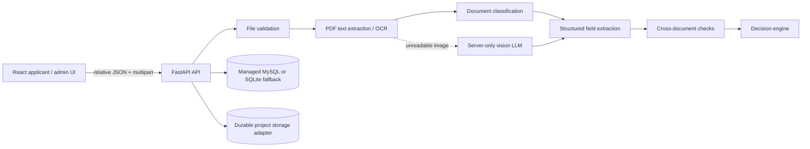

# Smart Application Processing architecture

The browser never decides the document type or outcome. It sends form fields and bytes to FastAPI. The backend validates file signatures, extracts text or requests server-side vision analysis, persists document metadata and structured results, and runs deterministic cross-checks before returning an outcome. Low confidence is a first-class result and becomes **Manual Review**.

In development, SQLite and `data/uploads` are used when the managed `DATABASE_URL`/storage environment is absent. The storage adapter keeps a stable object key so the development implementation can be replaced by the managed object-store presign flow without changing the applicant UI.
